<div align="center">


</div>

<br />

<div align="center">

### AI Agents, by the numbers


<sub>Jul~Sep 2026 · Claude Code + Codex · billed as subscriptions, valued at public API rates</sub>

<br /><br />



</div>

<br />

<table align="center">
<tr>
<td width="50%" valign="top">

#### 🔁 How I work with agents

```
requirements → plan → build → review → fix
     ↑                              ↓
     └──────── verified ────────────┘
```

**각 단계를 재사용 가능한 Skill 로 분리했습니다.**
요구사항과 설계, 계획과 검토는 직접 맡고
구현은 에이전트가 수행합니다.

</td>
<td width="50%" valign="top">

#### ✅ What I check before merging

`회귀` 바꾸기 전 출력과 문자 단위 대조
`정답지` 원문과 변환 결과의 표 항목 비교
`LLM 평가` 병합 셀과 읽기 순서 보존 판정

**에이전트가 낸 변경도 같은 기준을 통과해야**
**머지합니다.**

</td>
</tr>
</table>

<br />

<div align="center">

### Stack


</div>

<br />

<div align="center">

### Built with this workflow

| | |
|:--|:--|
| **[dooray-cli](https://github.com/jon890/dooray-cli)** | 사내 업무 도구를 에이전트가 다루도록 감싼 CLI |
| **[nhncloud-cli](https://github.com/jon890/nhncloud-cli)** | 인스턴스, 클러스터 업그레이드, 로그 조회 자동화 |

</div>

<br />

<div align="center">


</div>

<div align="center">


</div>
